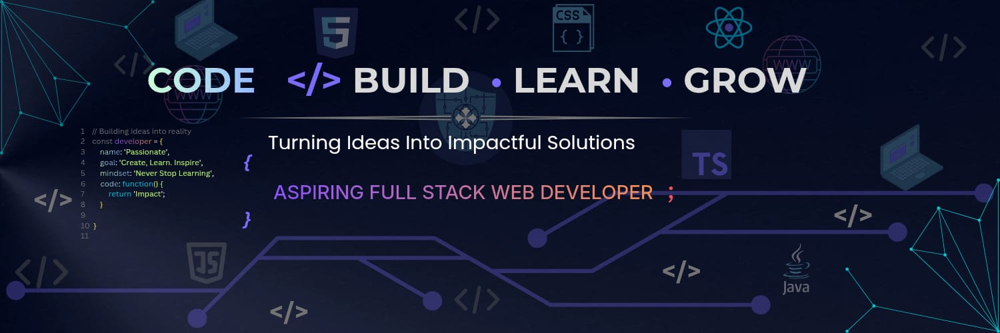

  

# Hi 👋, I'm Md. Zubaer Ahmed

* 🔭 I’m currently working on **Web Development Projects**
* 🌱 I’m currently learning **React, C++ and Python**
* 👯 I’m looking to collaborate on **Web Development Projects**
* 🤝 I’m looking for help with **Full Stack Web Development**
* 💬 Ask me about **C, Java, HTML, CSS, JavaScript and TypeScript**
* 📚 I’m currently exploring **Cybersecurity and Cloud Computing**
* ⚡ Fun fact: **I enjoy learning new technologies and building projects**

---

# 👋 About Me

Hi, I'm **Md. Zubaer Ahmed**, a Computer Science & Engineering student and aspiring **Full Stack Web Developer** from Bangladesh.

💻 I'm passionate about programming and web development. I enjoy building projects, solving programming problems, and learning how different technologies work.

🚀 Currently, I'm improving my skills in **front-end development** while learning **React, C++ and Python**. I'm also exploring **Cybersecurity and Cloud Computing**.

🎯 My goal is to become a skilled **Software Engineer / Full Stack Developer** and build useful, real-world applications.

---

# 🛠️ Technologies & Tools

### Programming Languages

* C
* Java
* JavaScript
* TypeScript

### Web Development

* HTML5
* CSS3

### Tools & Technologies

* GitHub
* Linux
* Arduino
* Figma

---

# 🎯 Currently Learning

* ⚛️ **React**
* 💻 **C++**
* 🐍 **Python**
* 🌐 **Full Stack Web Development**

---
## 💻 Tech Stack:

  

---

# 🌐 Connect with Me

  

  

---

# 📊 GitHub Stats

  

  

  

---

  <b>“Always learning, always building.”</b>

